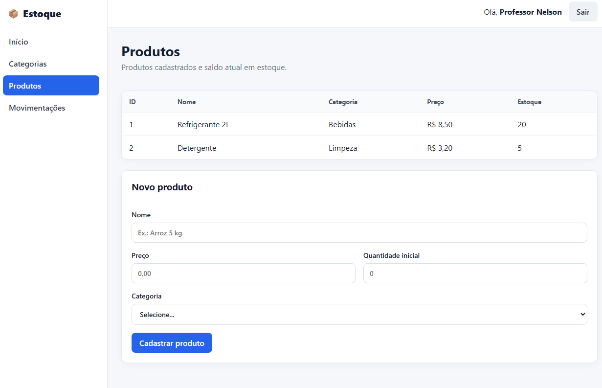
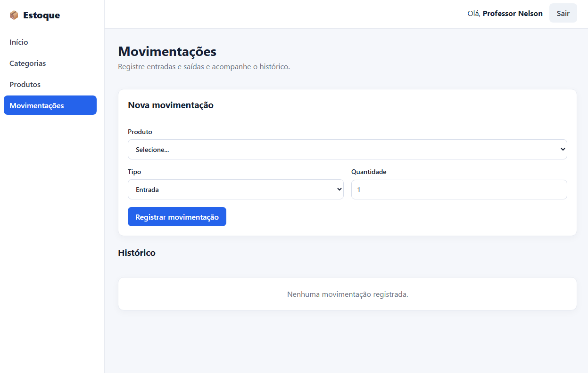

# Atividade Prática — Produtos e Movimentações

Implementação das telas de **Produtos** e **Movimentações** do sistema de controle de estoque.

## Executar

```bash
npm install
npm run dev
```

## Build

```bash
npm run build
```

## Login do mock

- E-mail: `professor@ifpr.edu.br`
- Senha: `123456`

## Prints das telas

> Antes da entrega, adicione aqui um print da tela de Produtos e um print da tela de Movimentações, conforme solicitado no enunciado.

### Produtos

<!-- Exemplo:  -->

### Movimentações

<!-- Exemplo:  -->
